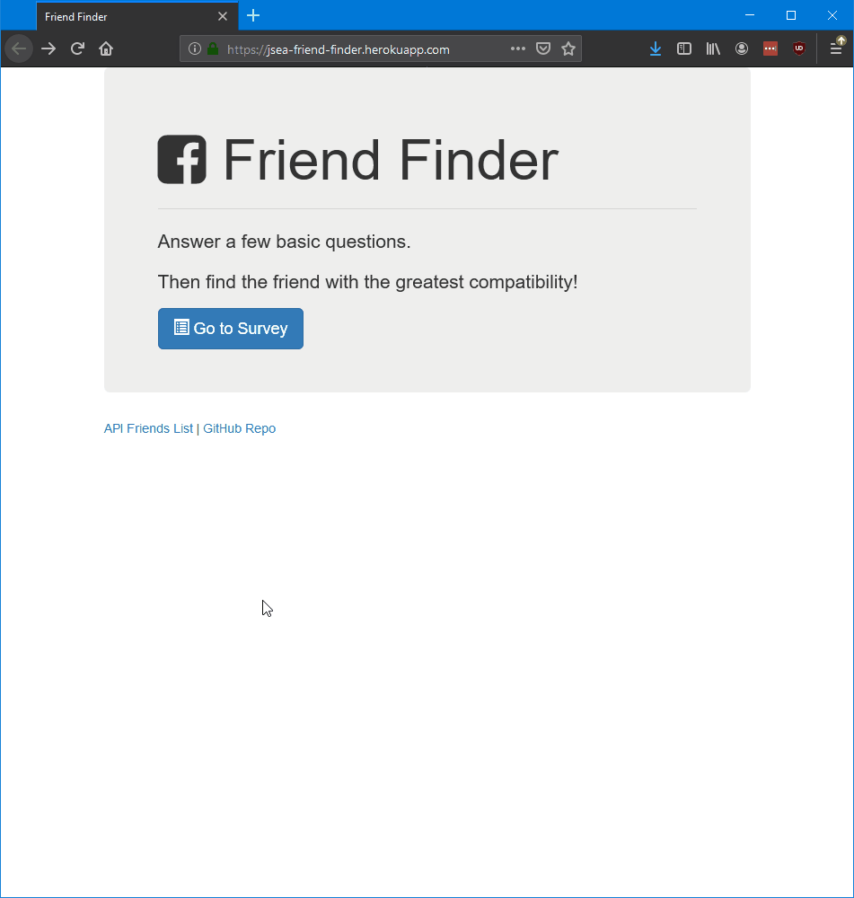

# Friend Finder

## Summary
This is a friend-finding app. The user takes a survey to determine who would be a best match for friendship within our app's stored list of potential matches.

## Overview
Created using Node.js, this app takes user input via a survey form web page, conducts the relevant matching of survey answers against potential matches, displays the best match in a modal, and also stores the survey taker's information on our server for other survey takers to match against.

## Preview


## Installation

From inside **Git Bash**, enter in the following line by line:

```
git clone https://github.com/j-sea/friend-finder.git
cd friend-finder
npm install
```

## Run

From inside **Git Bash**, while in the `friend-finder` folder, enter the following:

```
node server
```

You can then click the link logged in the console to open up the Friend Finder website.

## Node.js Package Dependencies

* `express`
* `path`

## About

This app was programmed by Jonathan Chan.

For help on this project, you can send an email towards jsea@uw.edu.